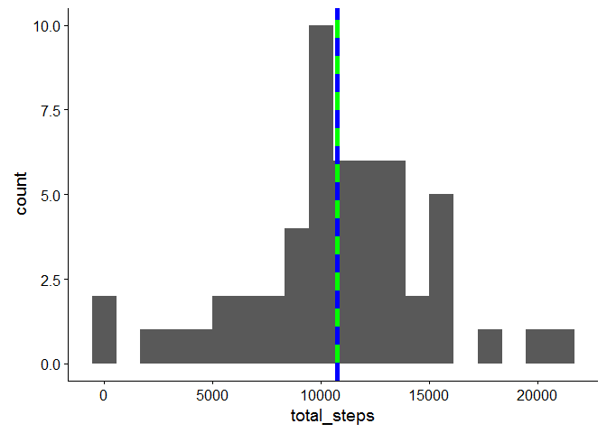
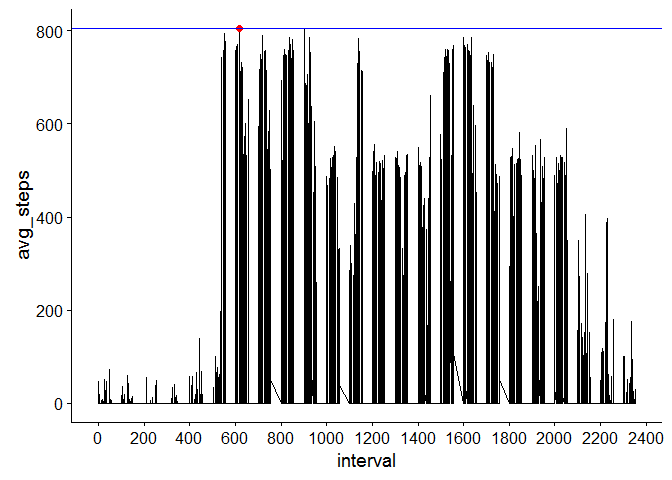
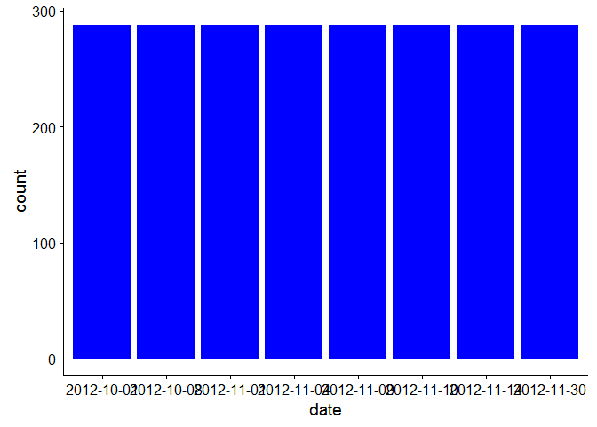
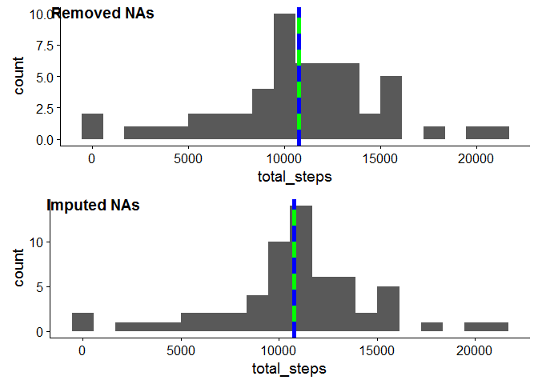
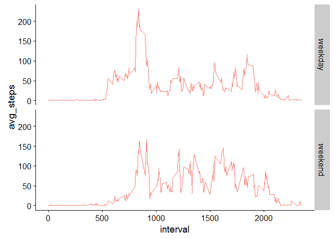

# Reproducible Research: Peer Assessment 1

## Loading required packages

```r
library(ggplot2)
library(dplyr)
library(lubridate)
library(knitr)
library(cowplot)
```

## Loading and preprocessing the data

```r
data_source <- "https://d396qusza40orc.cloudfront.net/repdata%2Fdata%2Factivity.zip"

download.file(data_source, "activity.zip", method = "curl") 
unzip("activity.zip", exdir = ".")

activity_data <- read.csv("activity.csv") %>%
                 mutate(timestamp = as.POSIXct(as.Date(date) + minutes(interval)))
```

## What is mean total number of steps taken per day?

```r
total_steps_per_day <- activity_data %>% 
                       filter(!is.na(steps)) %>%
                       group_by(date) %>% 
                       summarize(total_steps = sum(steps))

plot1 <- ggplot(data = total_steps_per_day, aes(x = total_steps)) +
            geom_histogram(bins = 20) +
            geom_vline(aes(xintercept=mean(total_steps)), color = "green", size = 2) +
            geom_vline(aes(xintercept=median(total_steps)), color = "blue", size = 2, linetype = "dashed")
plot1
```

<!-- -->

## What is the average daily activity pattern?

```r
interval_avg <- activity_data %>%
                filter(!is.na(steps)) %>%
                group_by(date, interval) %>%
                summarize(avg_steps = mean(steps))

plot2 <- ggplot(data = interval_avg, aes(interval, avg_steps)) + 
            geom_line() +
            geom_point(data = interval_avg[which.max(interval_avg$avg_steps),], size = 2, color = "red") +
            geom_hline(aes(yintercept=max(avg_steps)), color="blue") +
            scale_x_continuous(breaks={function(lim) pretty(lim, 10)})
plot2
```

<!-- -->


## Imputing missing values

#### Calculate and report the total number of missing values in the dataset 

```r
with_missing <- activity_data %>% 
                filter(is.na(steps)) %>% 
                group_by(date) 

plot3 <- ggplot(data = with_missing, aes(date)) + geom_bar(fill="blue")
plot3
```

<!-- -->

#### Replace missing values with the mean of the interval

```r
imputed_data <- activity_data %>%
                group_by(interval) %>%
                mutate(steps = replace(steps, is.na(steps), mean(steps, na.rm=TRUE))) 
```
#### What is the impact of imputing missing data on the estimates of the total daily number of steps?

```r
total_steps_imputed <- imputed_data %>%
                       group_by(date) %>% 
                       summarize(total_steps = sum(steps))

plot4 <- ggplot(data = total_steps_imputed, aes(x = total_steps)) +
          geom_histogram(bins = 20) +
          geom_vline(aes(xintercept=mean(total_steps)), color = "green", size = 2) +
          geom_vline(aes(xintercept=median(total_steps)), color = "blue", size = 2, linetype = "dashed")    

plot_grid(plot1, plot4, labels = c("Removed NAs", "Imputed NAs"), ncol = 1)
```

<!-- -->

## Are there differences in activity patterns between weekdays and weekends?

```r
with_day_type <- imputed_data %>%
                 mutate(day.type = ifelse(wday(date) %in% c(1,7), "weekend", "weekday")) %>%
                 group_by(interval, day.type) %>%
                 summarize(avg_steps = mean(steps))

ggplot(data = with_day_type, aes(interval, avg_steps, group = day.type, color = "red")) +
  geom_line() +
  facet_grid(day.type ~ .) +
  theme(legend.position = "none") 
```

<!-- -->
